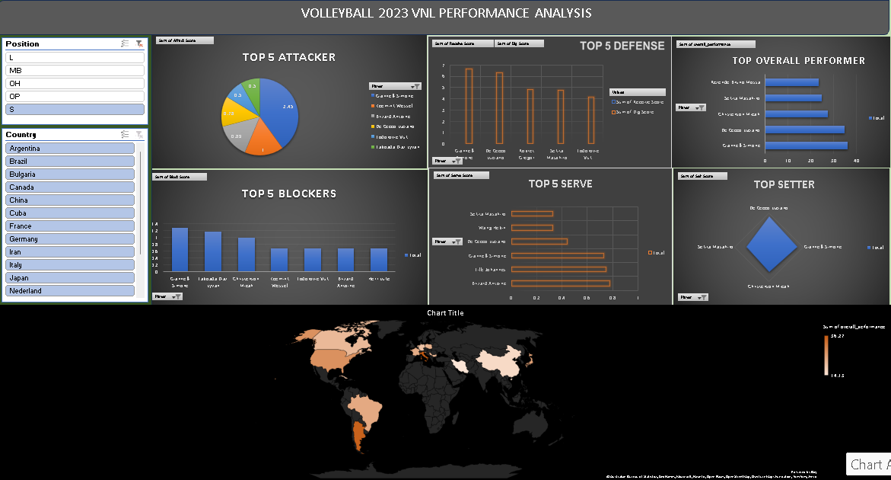

# 🏐 Volleyball Nations League 2023 – Excel Performance Dashboard



---

## 📊 Project Overview

This project presents an **interactive Excel dashboard** analyzing player performance from the **Volleyball Nations League (VNL) 2023** dataset.

The objective of this project was to demonstrate **end-to-end data analysis using Microsoft Excel**, including:

* Data cleaning
* Data transformation
* Performance metric creation
* Interactive visualization
* Dashboard design

The project highlights how **Excel can be used as a complete data analytics tool**, combining **Power Query, PivotTables, and interactive charts** to derive meaningful insights from sports data.

---

## 🎯 Project Goals

The main goals of this analysis were:

* Clean and transform raw CSV data using **Power Query**
* Build **derived performance metrics**
* Analyze **player performance across multiple skill categories**
* Create **interactive visualizations using Pivot Charts**
* Develop a **fully interactive dashboard using slicers**

---

# 📂 Project Structure

```
volleyball-vnl-performance-dashboard
│
├── data
│   └── VNL2023.csv
│
├── dashboard
│   └── volleyball_dashboard.xlsx
│
├── images
│   └── volleys_dashboard.png
│
└── README.md
```

| Folder    | Description                   |
| --------- | ----------------------------- |
| data      | Raw dataset used for analysis |
| dashboard | Final Excel dashboard         |
| images    | Dashboard preview for GitHub  |
| README.md | Project documentation         |

---

# 🧹 Data Cleaning (Power Query)

The dataset was cleaned using **Excel Power Query**, which allowed automated and repeatable data transformation.

### Key Data Cleaning Steps

✔ Imported CSV dataset using Power Query
✔ Promoted column headers
✔ Corrected data types for numerical columns
✔ Trimmed and cleaned text values
✔ Removed blank rows
✔ Removed duplicate records
✔ Renamed columns for clarity
✔ Reordered columns for logical structure

### Feature Engineering

Additional performance metrics were created using **custom columns**:

| Metric                  | Description                        |
| ----------------------- | ---------------------------------- |
| overall_offensive_score | Combined attacking contributions   |
| overall_defense_score   | Defensive contribution calculation |
| overall_performance     | Final player performance metric    |

These transformations were applied in **Power Query Applied Steps**, ensuring the workflow is reproducible.

---

# 📈 Data Analysis Using Pivot Tables

After cleaning the dataset, **PivotTables were used to summarize and analyze performance metrics**.

### Pivot Table Analysis Included

📌 Top attacking players
📌 Best blockers
📌 Top servers
📌 Defensive performance leaders
📌 Overall player performance ranking
📌 Setter performance analysis

PivotTables allowed quick aggregation of metrics such as:

* **Sum of attack score**
* **Sum of block score**
* **Sum of serve score**
* **Overall performance metrics**

---

# 📊 Pivot Charts & Visualization

PivotCharts were created from PivotTables to visualize player performance.

### Charts Included

📊 Top 5 Attackers – Pie Chart
📊 Top 5 Blockers – Bar Chart
📊 Top 5 Servers – Horizontal Bar Chart
📊 Top Defensive Players – Column Chart
📊 Top Overall Performers – Ranking Chart
🌍 Country Performance Map – Geographic Visualization

These visualizations allow quick identification of **top players and country-level performance patterns**.

---

# 🎛 Interactive Dashboard Features

The dashboard includes **interactive filtering capabilities** using slicers.

### Dashboard Filters

🔹 Player Position
🔹 Player Country

These slicers dynamically update all charts and metrics in the dashboard.

This enables users to explore:

* Performance by **player role**
* Performance by **country**
* Top players across different skill categories

---

# 🔍 Key Insights

Some insights observed from the dashboard:

* **Outside hitters dominate attacking metrics**
* **Middle blockers lead blocking statistics**
* Certain countries show consistently strong performance across multiple categories
* Top performers vary significantly based on position roles

---

# 🛠 Tools & Skills Demonstrated

This project demonstrates proficiency in:

### Excel Skills

✔ Power Query
✔ Data Cleaning
✔ Data Transformation
✔ Feature Engineering
✔ Pivot Tables
✔ Pivot Charts
✔ Dashboard Design

### Data Analysis Skills

✔ Exploratory Data Analysis (EDA)
✔ Data Aggregation
✔ Performance Metric Creation
✔ Interactive Visualization

---

# 📷 Dashboard Preview


---

# 🚀 What I Learned

Through this project I learned how to:

* Build **complete analytics workflows in Excel**
* Use **Power Query for automated data cleaning**
* Create **custom performance metrics**
* Design **interactive dashboards**
* Use **PivotTables for large-scale data summarization**
* Present insights through **clear visualizations**

---

# 📌 Future Improvements

Possible enhancements for this project:

* Build the dashboard using **Power BI**
* Add **player efficiency metrics**
* Include **team-level analysis**
* Add **match-level statistics**

---

# 👨‍💻 Author

**Shravan B**

Aspiring Data Analyst

---

⭐ If you found this project interesting, feel free to explore the dashboard and dataset!
